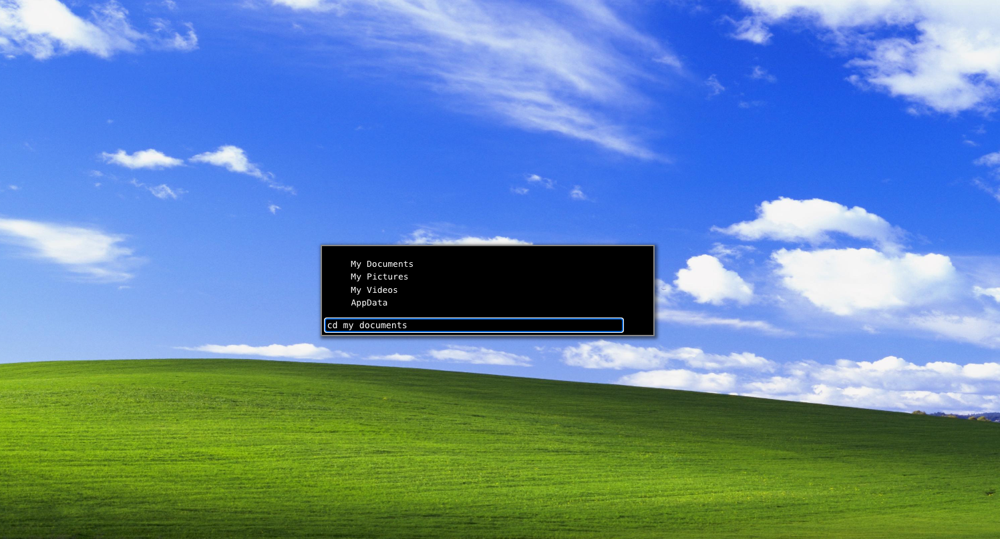

# Red Silicon - Hacking Minigame

This is a minigame loosely inspired by the hacking minigames in the Fallout series. It was originally implemented as part of a larger game I made called Red Silicon in Unreal Engine 4. It was part of the "Make a Programming Game" jam in the Summer of 2020.

The goal of game is to hack a door that is blocking the main character(Red) from progressing. Use "help" in the terminal for a list of commands if you're stuck.

I've ported it from C++ to React and TypeScript as a demonstration of my React competancy.

## Pre-requisites
- npm (node package manager)

## Instructions
Download the project and run the following commands:

- `npm install`
- `npm run dev`

Then visit [http://localhost:5173/](http://localhost:5173/) in your browser to play the game.

## Authors

- [@aimdiab](https://www.github.com/aimdiab)

## Screenshots

## Red Silicon

You can find the original full game at the link below

[Red Silicon on itch.io](https://aimd.itch.io/red-silicon)